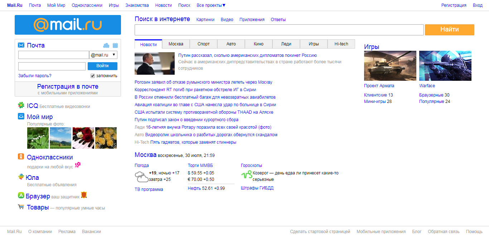

### This project represents the example of Mail.ru website.

## To run it you need to follow next steps:
#### 1. Install Node.js.
#### 2. Run `npm i` in console to install all dependences.
#### 3. Run `gulp` in console to start gulp process.

## Website markup:

